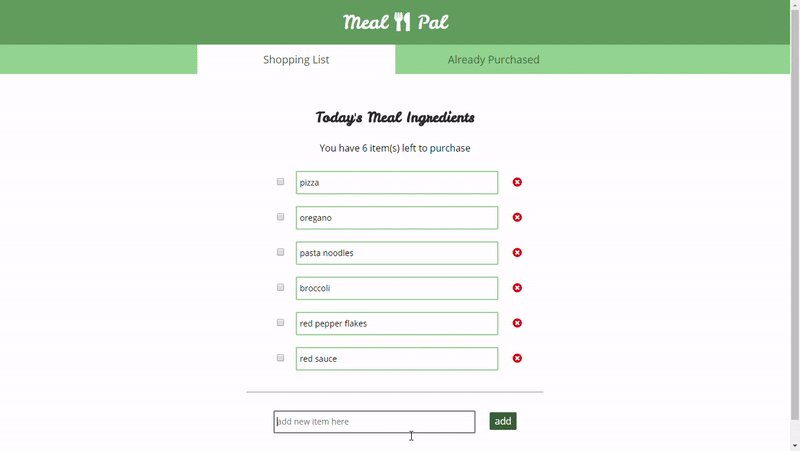

# Grocery CRUD in AngularJS 1.5

This application is a simple grocery-list tracker that utilizes CRUD methods with Firebase. It's built using AngularJS 1.5, and is mobile responsive.

## Technologies
Technology | Purpose
---- | ----
AngularJS 1.5 | Design and structure the front-end
Firebase | Host the application's data
LESS | Create and structure CSS 
Normalize.css | Standardize browser rendering of HTML

## The App in Action

## How to Use the App
The application is currently not hosted anywhere. You can view it on your machine locally with the following steps: 

* Clone down the repo.
* Run "npm install" in the command line to install the required node modules.
* Navigate to index.html in the src folder.
* Open index.html in the browser.

## How the App Works
* The application displays the grocery list by default and pulls un-purchased items from the Firebase collection.
* The user is able to delete current items from the database if they no longer wish to purchase them, which utilizes Firebase's remove method.
* The user can edit current items, which utilizes Firebase's update method as the user types.
* The user can add a new item to the list, which utilizes Firebase's add method.
* The user can check off an item to move it to the purchased list.
* The user can view the items they've already purchased. These items will display as crossed-out and un-editable.
* The user can delete items off the purchased list to clear out space.
* The user can un-check an item to move it back to the grocery list.

## Limitations
* The application is currently undeployed and needs to utilize Webpack to be hosted on Heroku.
* The application would benefit from being updated and rewritten in Typescript and ES6.
* The application's Angular file and folder structure should be updated to the most effective standards.
